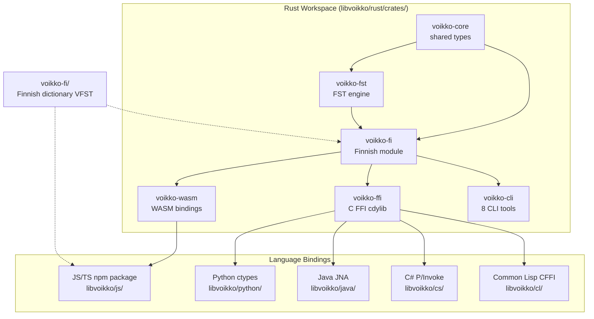

# CLAUDE.md

Guidance for AI assistants working on this repository.

## Project Overview

Corevoikko is a Finnish natural language processing library providing spell checking, morphological analysis, hyphenation, grammar checking, and tokenization. The core is written in Rust (edition 2024, MSRV 1.86) and compiled to both native code and WebAssembly. The original C++ implementation is preserved in `libvoikko/legacy/` for reference.

npm package: `@yongsk0066/voikko` v0.4.0. License: MPL 1.1 / GPL 2+ / LGPL 2.1+ (tri-license for libvoikko).

## Architecture



## Directory Structure

```
corevoikko/
├── libvoikko/
│   ├── rust/crates/           # Rust workspace (6 crates)
│   │   ├── voikko-core/       # Shared types — 68 tests
│   │   ├── voikko-fst/        # VFST FST engine — 71 tests
│   │   ├── voikko-fi/         # Finnish module — 494 tests, 10 ignored
│   │   ├── voikko-wasm/       # WASM bindings (189KB) — 4 tests
│   │   ├── voikko-ffi/        # C FFI cdylib (420KB), 30+ extern "C" functions
│   │   └── voikko-cli/        # 8 CLI binaries
│   ├── js/                    # npm package @yongsk0066/voikko — 37 vitest
│   ├── python/                # Python ctypes bindings
│   ├── java/                  # Java JNA bindings
│   ├── cs/                    # C# P/Invoke bindings
│   ├── cl/                    # Common Lisp CFFI bindings
│   ├── legacy/                # Original C++ source (preserved)
│   ├── doc/                   # API documentation
│   └── data/                  # Grammar help XML (gchelp.xml)
├── voikko-fi/                 # Finnish dictionary data (VFST format)
├── data/                      # Linguistic data (affix rules, word lists)
├── plan/                      # Porting design documents
├── tests/                     # Integration test data
├── tools/                     # Developer utilities (Python scripts)
├── docker/                    # Docker build environment
└── .github/workflows/         # CI, Release, CodeQL
```

## Build Commands

### Rust

```bash
cd libvoikko/rust
cargo fmt --all --check
cargo test --all-features         # 637 tests
cargo clippy --all-features -- -D warnings
cargo audit
```

### Benchmarks

```bash
cd libvoikko/rust
VOIKKO_DICT_PATH=../../voikko-fi/vvfst cargo bench -p voikko-fi --features handle
```

Seven benchmarks: spell, analyze, FST traverse, suggest, hyphenate, grammar, tokenize.

### WASM

```bash
cd libvoikko/rust
cargo build --target wasm32-unknown-unknown --release -p voikko-wasm
wasm-bindgen target/wasm32-unknown-unknown/release/voikko_wasm.wasm \
  --out-dir ../js/wasm --target web --typescript
wasm-opt ../js/wasm/voikko_wasm_bg.wasm -Oz --enable-bulk-memory \
  -o ../js/wasm/voikko_wasm_bg.wasm
```

### FFI (for Python/Java/C#/Common Lisp)

```bash
cd libvoikko/rust
cargo build --release -p voikko-ffi
# produces target/release/libvoikko_ffi.{dylib,so,dll}
```

### JS/TS Package

```bash
cd libvoikko/js
pnpm install && pnpm build    # dist/index.mjs (14KB) + dist/index.d.mts
pnpm test                     # 37 vitest
```

### CLI Tools

```bash
cd libvoikko/rust
VOIKKO_DICT_PATH=/path/to/dict cargo run -p voikko-cli --bin voikko-spell
```

Available binaries: `voikko-spell`, `voikko-suggest`, `voikko-analyze`, `voikko-hyphenate`, `voikko-tokenize`, `voikko-gc-pretty`, `voikko-baseform`, `voikko-readability`.

### Finnish Dictionary

```bash
cd voikko-fi
make vvfst                    # requires foma, python3, GNU make
make vvfst-install DESTDIR=~/.voikko
```

## CI/CD

Three GitHub Actions workflows:

- **CI** (push/PR to master): Rust format check, test, clippy, audit, then JS/WASM build and vitest.
- **Release** (tag `v*`): full test suite, then npm publish (with provenance) and GitHub Release.
- **CodeQL** (push/PR to master): JavaScript security analysis.

## Dictionary Files

The Finnish VFST dictionary consists of three files located at `voikko-fi/vvfst/`:

- `mor.vfst` (3.8MB) -- morphological transducer
- `autocorr.vfst` (11KB) -- autocorrect transducer
- `index.txt` -- dictionary metadata

These are also bundled in the npm package at `js/dict/`. The expected path structure for runtime is `{path}/5/mor-standard/{files}`.

## Validation

Run the full check suite before committing:

```bash
# Rust
cd libvoikko/rust && cargo fmt --all --check && cargo test --all-features && cargo clippy --all-features -- -D warnings && cargo audit

# JS/TS
cd libvoikko/js && pnpm test
```
