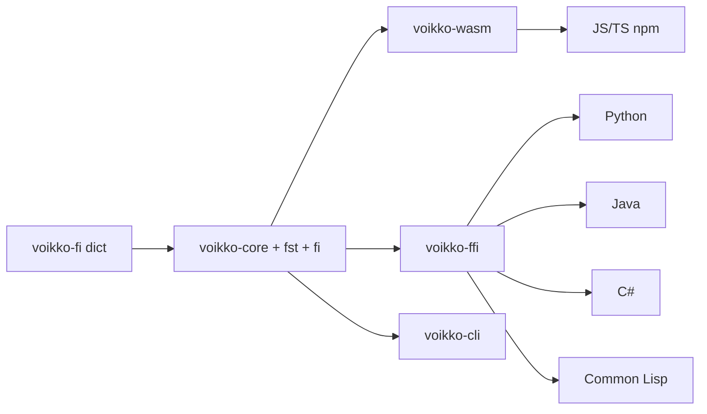

# Corevoikko

Finnish natural language processing library -- spell checking, morphological analysis, hyphenation, grammar checking, and tokenization.

This is a Rust rewrite of the original [Voikko](https://voikko.puimula.org/) C++ library, compiled to native code and WebAssembly. The original C++ source is preserved in `libvoikko/legacy/` for reference.

## Features

- **Spell checking** with compound word and derivation support
- **Spelling suggestions** tuned for common typing errors and OCR correction
- **Morphological analysis** with full inflection details
- **Hyphenation** with compound-aware splitting
- **Grammar checking** with context-sensitive paragraph analysis
- **Tokenization** and sentence splitting

## Quick Start

### npm (Browser / Node.js)

```bash
npm install @yongsk0066/voikko
```

```typescript
import { Voikko } from '@yongsk0066/voikko';

// Node.js -- dictionary is bundled, zero config
const voikko = await Voikko.init();

// Browser -- WASM and dictionary fetched from CDN automatically
const voikko = await Voikko.init();

// Browser (self-hosted) -- serve files from your own server
const voikko = await Voikko.init('fi', { dictionaryUrl: '/dict/', wasmUrl: '/voikko.wasm' });

voikko.spell('koira');        // true
voikko.suggest('koirra');     // ['koira', ...]
voikko.analyze('koirien');    // [{ BASEFORM: 'koira', CLASS: 'nimisana', ... }]
voikko.hyphenate('kissa');    // 'kis-sa'
voikko.terminate();
```

Finnish dictionary files are bundled in the npm package. Node.js users need no additional setup. Browser users can rely on automatic CDN loading, or copy dictionary files from `node_modules/@yongsk0066/voikko/dict/` to a public directory and pass `dictionaryUrl`.

### Rust

```bash
cd libvoikko/rust
cargo test --all-features     # 637 tests
cargo clippy --all-features -- -D warnings
```

### CLI Tools

Eight command-line tools for interactive use:

```bash
cd libvoikko/rust
VOIKKO_DICT_PATH=/path/to/dict cargo run -p voikko-cli --bin voikko-spell
```

Available: `voikko-spell`, `voikko-suggest`, `voikko-analyze`, `voikko-hyphenate`, `voikko-tokenize`, `voikko-gc-pretty`, `voikko-baseform`, `voikko-readability`.

### Native Library (FFI)

```bash
cd libvoikko/rust
cargo build --release -p voikko-ffi
# produces target/release/libvoikko_ffi.{dylib,so,dll}
```

Bindings for Python (ctypes), Java (JNA), C# (P/Invoke), and Common Lisp (CFFI) are in `libvoikko/python/`, `libvoikko/java/`, `libvoikko/cs/`, `libvoikko/cl/`.

### Finnish Dictionary

```bash
cd voikko-fi
make vvfst                    # requires foma, Python 3, GNU make
make vvfst-install DESTDIR=~/.voikko
```

## How It Fits Together



The Rust workspace in `libvoikko/rust/` contains six crates. The Finnish language module (`voikko-fi`) implements all NLP logic on top of shared types (`voikko-core`) and the FST engine (`voikko-fst`). Two output crates expose this to other languages: `voikko-wasm` for JavaScript via WebAssembly, and `voikko-ffi` for native bindings through a C API. The `voikko-cli` crate provides standalone command-line tools.

## Language Bindings

| Language | Location | Mechanism | Status |
|----------|----------|-----------|--------|
| JS/TS | `libvoikko/js/` | voikko-wasm (wasm-bindgen) | 37 vitest |
| Python | `libvoikko/python/` | ctypes via voikko-ffi | Verified |
| Java | `libvoikko/java/` | JNA via voikko-ffi | Scaffold |
| C# | `libvoikko/cs/` | P/Invoke via voikko-ffi | Scaffold |
| Common Lisp | `libvoikko/cl/` | CFFI via voikko-ffi | Scaffold |

## License

The repository uses layered licensing:

- **Repository overall**: GPL 3+
- **libvoikko**: additionally available under MPL 1.1 / GPL 2+ / LGPL 2.1+ (tri-license)
- **data, voikko-fi**: additionally available under GPL 2+

See [LICENSE](LICENSE) and [libvoikko/LICENSE.CORE](libvoikko/LICENSE.CORE) for full details.

## Credits

This project is a Rust rewrite of [Voikko](https://voikko.puimula.org/), originally created by Harri Pitkanen and contributors. The linguistic data in `voikko-fi/` is the work of the Voikko project contributors.

Rust rewrite and npm package by Yongseok Jang.

## Documentation

- [LEARNING.md](LEARNING.md) — domain knowledge guide for newcomers (FST, Finnish morphology, spell checking concepts, with AI study prompts)
- [ARCHITECTURE.md](libvoikko/rust/ARCHITECTURE.md) — Rust codebase architecture and design decisions

## Links

- [Live Demo](https://yongsk0066.github.io/corevoikko/) — try all features in the browser, no install needed
- [npm package](https://www.npmjs.com/package/@yongsk0066/voikko)
- [Original Voikko project](https://voikko.puimula.org/)
