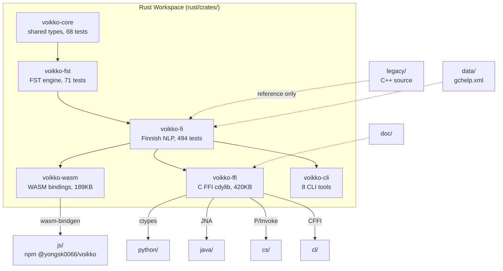

# CLAUDE.md -- libvoikko

Guidance for AI assistants working inside the `libvoikko/` directory.

## What This Directory Contains

`libvoikko/` is the library implementation of Voikko. The Rust workspace produces the core NLP engine, and multiple language bindings expose it to different runtimes.

## How the Subdirectories Relate



### rust/

The Cargo workspace containing six crates. All NLP logic lives here. See individual crate CLAUDE.md files for detailed architecture.

### js/

The npm package `@yongsk0066/voikko`. A TypeScript wrapper around `voikko-wasm` that handles WASM loading, dictionary loading, CDN fallback, caching, and typed errors. Has its own `CLAUDE.md` with build details.

### python/

`libvoikko.py` -- Python ctypes bindings that load `libvoikko_ffi.{dylib,so,dll}` at runtime.

### java/

Java JNA bindings via `VoikkoRust.java`. Scaffold status -- the binding layer works but has no dedicated test suite yet.

### cs/

C# P/Invoke bindings via `VoikkoRust.cs`. Scaffold status.

### cl/

Common Lisp CFFI bindings via `voikko-rust.lisp`. Scaffold status.

### legacy/

The original C++ source code, preserved for reference. Contains `cpp-src/`, `cpp-test/`, `cs-cpp/`, `autotools/`, and the Emscripten build. Not actively maintained -- all development happens in `rust/`.

### doc/

API documentation files: morphological analysis format, spelling suggestion rules.

### data/

`gchelp.xml` -- grammar error descriptions used by the grammar checker to produce human-readable error messages in Finnish and English.

## Build Commands

### Rust (full check)

```bash
cd rust
cargo fmt --all --check
cargo test --all-features         # 637 tests
cargo clippy --all-features -- -D warnings
cargo audit
```

### WASM

```bash
cd rust
cargo build --target wasm32-unknown-unknown --release -p voikko-wasm
wasm-bindgen target/wasm32-unknown-unknown/release/voikko_wasm.wasm \
  --out-dir ../js/wasm --target web --typescript
wasm-opt ../js/wasm/voikko_wasm_bg.wasm -Oz --enable-bulk-memory \
  -o ../js/wasm/voikko_wasm_bg.wasm
```

### FFI

```bash
cd rust
cargo build --release -p voikko-ffi
# produces target/release/libvoikko_ffi.{dylib,so,dll}
```

### JS/TS

```bash
cd js
pnpm install && pnpm build    # dist/index.mjs (14KB)
pnpm test                     # 37 vitest
```

### CLI Tools

```bash
cd rust
VOIKKO_DICT_PATH=/path/to/dict cargo run -p voikko-cli --bin voikko-spell
```

Available: `voikko-spell`, `voikko-suggest`, `voikko-analyze`, `voikko-hyphenate`, `voikko-tokenize`, `voikko-gc-pretty`, `voikko-baseform`, `voikko-readability`.

## Conventions

- Rust edition 2024, MSRV 1.86.
- All crates use workspace-level `edition`, `rust-version`, and `license`.
- Release profile: `opt-level = "z"`, LTO, single codegen unit, strip symbols, panic = abort.
- The C API header is at `rust/crates/voikko-ffi/include/voikko.h`.
- Dictionary files are not in this directory -- they live in `voikko-fi/` at the repo root and are bundled into `js/dict/` for the npm package.
