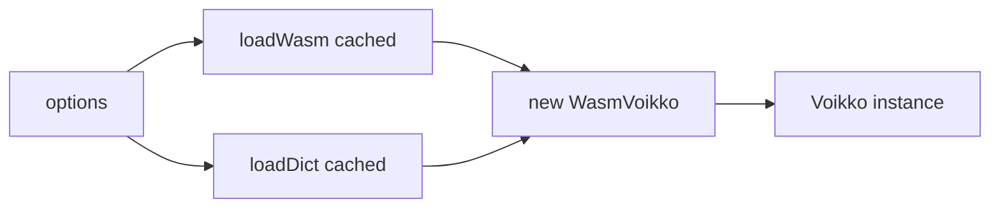

# CLAUDE.md -- JS/WASM Package

npm: `@yongsk0066/voikko` v0.4.0. Thin ESM TypeScript wrapper around the Rust `voikko-wasm` crate (wasm-bindgen).

## Stack

- **pnpm** package manager
- **tsdown** bundler (rolldown-based, generates `.d.ts`, injects `__PKG_VERSION__` define)
- **vitest** test framework (37 tests)
- **ESM only** -- no CJS support

## Directory Layout

```
js/
├── src/
│   ├── index.ts          # Voikko class (~270 lines, pure delegation + type mapping)
│   ├── types.ts           # TS types (Analysis, Token, Sentence, GrammarError, VoikkoInitOptions)
│   └── wasm-loader.ts     # loadWasm, loadDict, error classes, caching logic
├── test/
│   ├── voikko.test.ts     # 37 vitest tests
│   └── setup-dict.ts      # globalSetup: monorepo dictionary auto-detection
├── dict/                  # Bundled dictionary (mor.vfst 3.8MB, autocorr.vfst, index.txt)
├── wasm/                  # wasm-bindgen output (voikko_wasm_bg.wasm 189KB + .js + .d.ts)
├── dist/                  # tsdown build output (index.mjs 14KB + index.d.mts)
├── test.html              # Browser manual test page
├── tsdown.config.ts       # Build config with __PKG_VERSION__ define
└── package.json
```

## Build

```bash
cd libvoikko/js
pnpm install
pnpm build     # dist/index.mjs + dist/index.d.mts
pnpm test      # 37 vitest
```

## Architecture

### Initialization Pipeline



`loadWasm` and `loadDict` run in parallel via `Promise.all`. Both are cached with error-invalidation: if loading fails, the cache entry is cleared so the next call retries.

### Source Files

**index.ts** -- The `Voikko` class. Private constructor; public static `init()` factory. Every method delegates to `WasmVoikko` (the wasm-bindgen handle) after an `ensureActive()` guard. Type mapping converts WASM return values (PascalCase enums like `Word`, `Probable`) to the public TS types (SCREAMING_CASE like `WORD`, `PROBABLE`).

**wasm-loader.ts** -- Two loaders:
- `loadWasm(options)` -- loads and initializes the WASM module. Node.js reads the `.wasm` file from disk; browser fetches from `wasmUrl` or CDN.
- `loadDict(options)` -- loads dictionary files. Resolution order: explicit `dictionaryUrl`/`dictionaryPath` > Node.js bundled dict > browser CDN.

Dictionary files are split into required (`index.txt`, `mor.vfst`) and optional (`autocorr.vfst`). Required files throw `DictionaryLoadError` on failure; optional files log warnings.

Node.js filesystem loading auto-detects flat layout (`dict/mor.vfst`) and V5 structure (`dict/5/mor-standard/mor.vfst`).

**types.ts** -- Pure type definitions. `Analysis` uses an index signature `[key: string]: string | undefined` for extensibility beyond the known morphological attributes.

### Error Classes (wasm-loader.ts)

- `VoikkoError` -- base error
- `WasmLoadError extends VoikkoError` -- WASM load/init failure (includes `cause`)
- `DictionaryLoadError extends VoikkoError` -- dictionary load failure (includes `fileName` and `cause`)

### Voikko Class (index.ts)

- `#handle: WasmVoikko | null` + `#terminated: boolean`
- `ensureActive()` throws a clear error after `terminate()`
- `terminate()` is idempotent (no-op on second call)
- All business logic lives in Rust (voikko-fi crate). The TS layer is pure delegation + type mapping.
- `attributeValues(name)` returns possible values for a morphological attribute, or `null`.

### CDN Version Sync

`__PKG_VERSION__` is injected at build time by tsdown (and vitest) from `package.json` version. CDN URLs use this version: `https://unpkg.com/@yongsk0066/voikko@{version}/...`

### Dictionary Path Resolution

- **Node.js default**: bundled `dict/` directory (zero-config)
- **Node.js `dictionaryPath`**: auto-detects flat or V5 structure
- **Browser default**: unpkg CDN with flat layout
- **Browser `dictionaryUrl`**: V5 structure (`{url}/5/mor-standard/{file}`)

### Package Exports

Single ESM entrypoint: `dist/index.mjs`. Published files: `dist/`, `wasm/`, `dict/`.

### Key Types Exported

Classes: `Voikko`, `VoikkoError`, `WasmLoadError`, `DictionaryLoadError`

Type aliases: `Token`, `Sentence`, `GrammarError`, `Analysis`, `TokenType`, `SentenceStartType`, `SuggestionStrategy`, `VoikkoInitOptions`
