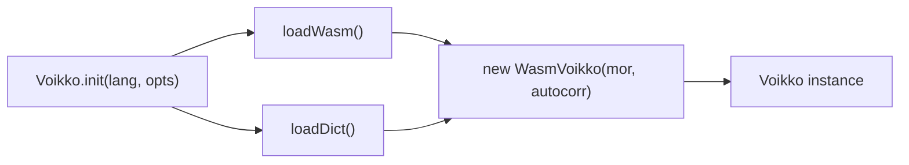

# @yongsk0066/voikko

Finnish NLP library for JavaScript -- spell checking, morphological analysis, hyphenation, grammar checking, and tokenization. Powered by Rust compiled to WebAssembly.

## Install

```bash
npm install @yongsk0066/voikko
```

## Quick Start

### Node.js (zero-config)

The Finnish dictionary is bundled in the package. No setup required.

```typescript
import { Voikko } from '@yongsk0066/voikko';

const voikko = await Voikko.init();

voikko.spell('koira');       // true
voikko.spell('koirra');      // false
voikko.suggest('koirra');    // ['koira', 'koiraa', ...]
voikko.analyze('koirien');   // [{ BASEFORM: 'koira', CLASS: 'nimisana', ... }]
voikko.hyphenate('kissa');   // 'kis-sa'

voikko.grammarErrors('Minä on hyvä.');
// [{ errorCode: 1, startPos: 0, errorLen: 6, suggestions: ['Minä olen'], ... }]

voikko.tokens('Hei maailma!');
// [{ type: 'WORD', text: 'Hei' }, { type: 'WHITESPACE', text: ' ' }, ...]

voikko.sentences('Hei. Miten menee?');
// [{ text: 'Hei. ', nextStartType: 'PROBABLE' }, { text: 'Miten menee?', ... }]

voikko.terminate(); // release resources
```

### Browser (zero-config)

WASM and dictionary files are automatically fetched from CDN.

```typescript
import { Voikko } from '@yongsk0066/voikko';

const voikko = await Voikko.init();
voikko.spell('koira'); // true
```

### Browser (self-hosted)

Serve files yourself to avoid CDN dependency:

```typescript
const voikko = await Voikko.init('fi', {
  dictionaryUrl: '/dict/',   // expects /dict/5/mor-standard/{files}
  wasmUrl: '/voikko.wasm',
});
```

Copy dictionary files from `node_modules/@yongsk0066/voikko/dict/` and the WASM binary from `node_modules/@yongsk0066/voikko/wasm/voikko_wasm_bg.wasm` to your public directory.

## Initialization



Both WASM and dictionary loading run in parallel. Results are cached after the first call -- subsequent `Voikko.init()` calls reuse the loaded modules instantly.

### `Voikko.init(language?, options?)`

Returns `Promise<Voikko>`.

- `language` -- BCP 47 tag (default: `'fi'`)
- `options.dictionaryUrl` -- URL base for dictionary files (browser, expects V5 layout)
- `options.dictionaryPath` -- filesystem path to dictionary (Node.js, flat or V5 layout)
- `options.wasmUrl` -- URL to WASM binary (browser)

All options are optional. Defaults to bundled dictionary (Node.js) or CDN (browser).

## API

### Spell Checking

- `voikko.spell(word)` -- returns `boolean`
- `voikko.suggest(word)` -- returns `string[]`

### Morphological Analysis

- `voikko.analyze(word)` -- returns `Analysis[]`

Each `Analysis` object contains morphological attributes as key-value pairs: `BASEFORM`, `CLASS`, `STRUCTURE`, `SIJAMUOTO`, `NUMBER`, `PERSON`, `MOOD`, `TENSE`, `PARTICIPLE`, `POSSESSIVE`, `COMPARISON`, `NEGATIVE`, `FOCUS`, `WORDBASES`, `WORDIDS`, `FSTOUTPUT`.

- `voikko.attributeValues(name)` -- returns `string[] | null`. Lists possible values for a given morphological attribute.

### Hyphenation

- `voikko.hyphenate(word, separator?, allowContextChanges?)` -- returns `string` with separator inserted at break points
- `voikko.getHyphenationPattern(word)` -- returns a pattern string where `' '` = no break, `'-'` = hyphenation point (preserved), `'='` = hyphenation point (replaced)

### Grammar Checking

- `voikko.grammarErrors(text)` -- returns `GrammarError[]`. Accepts multiple paragraphs separated by newlines.

### Tokenization

- `voikko.tokens(text)` -- returns `Token[]` with types: `WORD`, `PUNCTUATION`, `WHITESPACE`, `UNKNOWN`
- `voikko.sentences(text)` -- returns `Sentence[]`

### Options

```typescript
voikko.setIgnoreDot(boolean)
voikko.setIgnoreNumbers(boolean)
voikko.setIgnoreUppercase(boolean)
voikko.setAcceptFirstUppercase(boolean)
voikko.setAcceptAllUppercase(boolean)
voikko.setIgnoreNonwords(boolean)
voikko.setAcceptExtraHyphens(boolean)
voikko.setAcceptMissingHyphens(boolean)
voikko.setAcceptTitlesInGc(boolean)
voikko.setAcceptUnfinishedParagraphsInGc(boolean)
voikko.setAcceptBulletedListsInGc(boolean)
voikko.setNoUglyHyphenation(boolean)
voikko.setHyphenateUnknownWords(boolean)
voikko.setMinHyphenatedWordLength(number)
voikko.setSuggestionStrategy('TYPO' | 'OCR')
```

### Cleanup

- `voikko.terminate()` -- releases all resources. Safe to call multiple times. The instance must not be used after the first call.

## Error Handling

Three typed error classes for programmatic handling:

```typescript
import { Voikko, WasmLoadError, DictionaryLoadError } from '@yongsk0066/voikko';

try {
  const voikko = await Voikko.init();
} catch (e) {
  if (e instanceof WasmLoadError) {
    console.error('WASM failed to load:', e.message);
  } else if (e instanceof DictionaryLoadError) {
    console.error('Dictionary file missing:', e.fileName);
  }
}
```

Calling methods on a terminated instance throws immediately:

```typescript
voikko.terminate();
voikko.spell('koira'); // Error: Cannot use Voikko instance after terminate()
```

## Bundle Size

| Component | Size |
|-----------|------|
| JS wrapper | 14 KB |
| WASM binary | 189 KB |
| Dictionary | 3.8 MB |

In Node.js, all files are bundled in the package. In the browser, WASM and dictionary are fetched on first load (~4 MB total, then cached by the browser).

## Next.js / SSR

Voikko uses WebAssembly and must be initialized on the client side:

```typescript
'use client';
import { useState, useEffect } from 'react';
import type { Voikko as VoikkoType } from '@yongsk0066/voikko';

export function useVoikko() {
  const [voikko, setVoikko] = useState<VoikkoType | null>(null);

  useEffect(() => {
    let instance: VoikkoType | null = null;
    import('@yongsk0066/voikko').then(({ Voikko }) =>
      Voikko.init().then((v) => { instance = v; setVoikko(v); })
    );
    return () => { instance?.terminate(); };
  }, []);

  return voikko;
}
```

## Concurrency

A single Voikko instance is safe to use across multiple async operations. One instance per process is recommended for Node.js servers:

```typescript
const voikko = await Voikko.init();

app.get('/spell/:word', (req, res) => {
  res.json({ correct: voikko.spell(req.params.word) });
});

process.on('SIGTERM', () => voikko.terminate());
```

## License

[MPL 1.1 / GPL 2+ / LGPL 2.1+](https://github.com/yongsk0066/corevoikko/blob/master/LICENSE)
