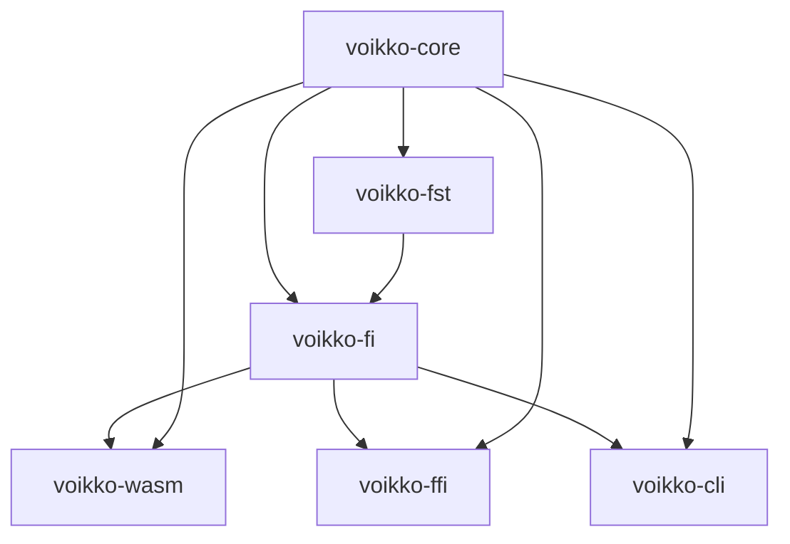
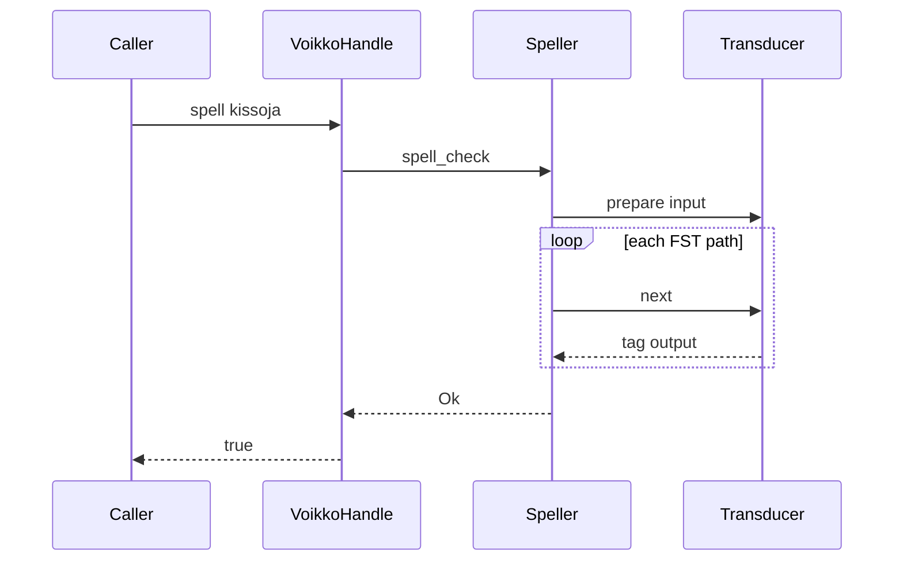

# Architecture

This document helps new contributors understand how the Rust codebase is organized and what domain knowledge is needed to work on it effectively.

If you're looking for build commands, see the root [CLAUDE.md](../../CLAUDE.md). If you want to understand the porting decisions, see the [plan/](../../plan/) directory.

## How to read the code

Start from the top-level API and work your way down:

1. **`voikko-fi/src/handle.rs`** — `VoikkoHandle` is the single entry point. All public methods (spell, suggest, analyze, hyphenate, grammar check, tokenize) live here. Read this first.

2. **`voikko-fi/src/morphology/`** — The analyzer takes a word, walks the FST graph, and returns structured morphological data. This is where Finnish-specific logic lives.

3. **`voikko-fst/src/`** — The FST engine that reads `.vfst` binary files and traverses the graph. Language-agnostic — it knows nothing about Finnish.

4. **`voikko-core/src/`** — Shared types used by everything above. `Analysis`, `Token`, `GrammarError`, enums, character utilities.

The three output crates (`voikko-wasm`, `voikko-ffi`, `voikko-cli`) are thin wrappers around `VoikkoHandle`. You rarely need to touch them unless you're changing the public API surface.

## Crate dependency flow

Data flows downward at construction time: raw `.vfst` bytes go into `voikko-fst` to build a `Transducer`, which `voikko-fi` wraps into a `VoikkoHandle`. At query time, a method call on `VoikkoHandle` delegates to the appropriate module (speller, analyzer, etc.), which in turn calls `Transducer::next()` to walk the FST graph.

### Query-time data flow

## The six crates

### voikko-core

Shared types that every other crate depends on. `Analysis` (a `HashMap<String, String>` of morphological attributes), `Token`, `Sentence`, `GrammarError`, and enums like `TokenType` and `SpellResult`. Also contains character classification and case detection utilities.

This crate has no external dependencies other than `thiserror`. If you're adding a new type that multiple crates need, it goes here.

### voikko-fst

The FST engine. It reads `.vfst` binary files and provides a `Transducer` trait with two methods: `prepare()` sets up the input, and `next()` yields one output path at a time.

The traversal uses an explicit DFS stack (no recursion) to keep memory usage predictable. Transitions are loaded via zero-copy `bytemuck` casting for performance. The engine supports both unweighted and weighted transducers.

This crate is language-agnostic. It doesn't know what Finnish is — it just follows graph edges and returns symbol sequences. See [Domain knowledge](#domain-knowledge) below for how FST works.

### voikko-fi

Finnish-specific NLP modules. Each module is behind a feature flag:

- `morphology` ("analyze") — walks the FST and parses output tags into `Analysis` structs
- `speller` ("spell") — uses morphology to determine if a word is valid
- `suggestion` ("suggest") — generates correction candidates for misspelled words
- `hyphenator` ("hyphenate") — determines valid hyphenation points
- `grammar` ("grammar") — paragraph-level grammar error detection
- `tokenizer` (always enabled) — splits text into words, punctuation, whitespace

`handle.rs` ties them all together into `VoikkoHandle`, the unified API. Most contributors will work in this crate.

### voikko-wasm

A `wasm-bindgen` wrapper that exposes `WasmVoikko` to JavaScript. Complex return types (analyses, grammar errors, tokens) are serialized to JS objects via `serde-wasm-bindgen`. The WASM binary is 189KB after `wasm-opt -Oz`.

### voikko-ffi

A C-compatible FFI layer (`extern "C"` functions) for Python, Java, C#, and Common Lisp bindings. It manages memory manually — every allocated return value has a corresponding `voikko_free_*()` function. A `bool_setter!` macro generates the 14 boolean option setters.

### voikko-cli

Eight command-line tools for testing and demonstration. Each binary reads a dictionary from `VOIKKO_DICT_PATH` and processes stdin. These are useful for manual testing but aren't part of the library's public API.

## Key design decisions

**Interior mutability for caching.** `VoikkoHandle` methods take `&self` (not `&mut self`) so the handle can be shared. But the speller cache needs mutation, so it uses `RefCell<SpellerCache>`. This is a deliberate trade-off — the alternative was requiring `&mut self` on every spell check call.

**No self-referential lifetimes.** The grammar checker and speller adapters could hold references to the analyzer, but that would create self-referential structs (which Rust doesn't allow without `Pin` or unsafe). Instead, adapter objects are created on-demand in each method call.

**Coroutine-style FST traversal.** Rather than collecting all results into a Vec, the `Transducer` trait uses a prepare/next pattern. The caller calls `next()` repeatedly until it returns `false`. This avoids allocating when only the first result is needed (common in spell checking).

**Feature gating.** Modules like suggestion and grammar are behind feature flags. This keeps the WASM binary small when only spell checking is needed, and speeds up compilation during development.

## Domain knowledge

Working on this codebase requires understanding two things: FST (the data structure) and Finnish morphology (the linguistics). You don't need deep expertise in either, but a working mental model helps.

### Finite State Transducer (FST)

An FST is a directed graph where edges are labeled with input/output symbol pairs. You feed it a string character by character, following matching edges. If you reach an accepting state, the input is recognized and the output symbols collected along the path form the result.

For Voikko's use case: the input is a Finnish word (like "kissoja") and the output is a tag string describing its morphological structure (like "[Ln][Xp]kissa[X]kissoja[Spar][Nm]"). One input can have multiple valid paths, meaning a word can have multiple analyses.

The `.vfst` binary format stores this graph compactly:

- **Header** (16 bytes): 8-byte magic number, 1-byte weighted/unweighted flag, 7 reserved bytes
- **Symbol table**: 2-byte count followed by null-terminated UTF-8 strings mapping indices to characters
- **Padding**: aligned to 8-byte (unweighted) or 16-byte (weighted) boundary
- **Transition table**: array of (input symbol, output symbol, target state) tuples -- 8 bytes each for unweighted, 16 bytes for weighted (+weight)

The `voikko-fst` crate loads this binary, builds the graph in memory, and provides the traversal API.

**Flag diacritics** are a special mechanism in the FST. They're not real characters but control symbols that constrain which paths are valid. For example, a flag might say "this path is only valid if CASE=NOM was set earlier." The five flag types are P (push), C (clear), U (unify), R (require), and D (disallow). The implementation is in `voikko-fst/src/flags.rs`.

### Finnish morphology

Finnish is an agglutinative language — words are built by combining roots with suffixes. "kissoja" is "kissa" (cat) + plural partitive suffix. "talossanikin" is "talo" (house) + inessive "ssa" + possessive "ni" + clitic "kin" — meaning "in my house too."

Compound words are also formed by joining multiple roots: "kissanpentu" = "kissa" (cat) + linking "n" + "pentu" (cub).

This means the number of valid word forms is enormous. Instead of listing them all, the FST encodes the rules for combining roots and suffixes. The morphology module (`voikko-fi/src/morphology/`) walks the FST and parses the output tags to extract:

- **BASEFORM** — the dictionary form of the word
- **CLASS** — part of speech (nimisana=noun, teonsana=verb, etc.)
- **SIJAMUOTO** — grammatical case (nimento=nominative, osanto=partitive, etc.)
- **NUMBER** — singular or plural
- **STRUCTURE** — how the word is composed from morphemes

The tag format is specific to Voikko and documented in `voikko-fi/src/morphology/tag_parser.rs`. If you need to add a new morphological attribute, that's where to start.

### Where to learn more

- The [plan/](../../plan/) directory contains the porting design documents from the C++ → Rust migration. `plan/phase2-rust/02-fst-engine.md` explains the FST format in detail.
- The [voikko-fi dictionary](../../voikko-fi/) directory contains the linguistic source data (foma scripts) that compile into `.vfst` files.
- [foma](https://fomafst.github.io/) is the external tool that compiles language rules into FST graphs.
