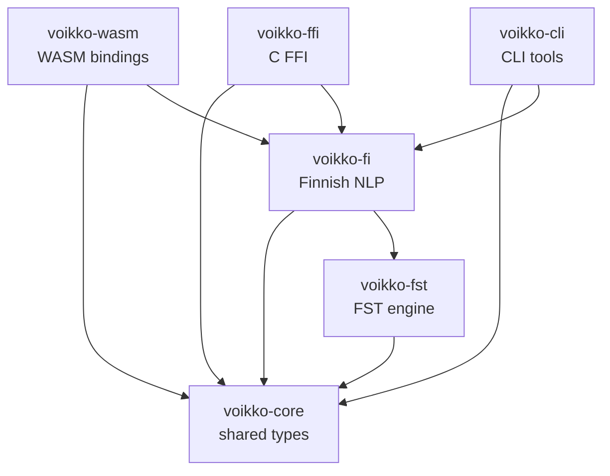

# Rust Workspace

Cargo workspace containing 6 crates that implement Finnish NLP in Rust. This is the core engine behind the `@yongsk0066/voikko` npm package.

## Workspace configuration

- **Edition**: 2024
- **Resolver**: v3
- **Minimum Rust version**: 1.86
- **License**: MPL-1.1 OR GPL-2.0-or-later OR LGPL-2.1-or-later
- **Release profile**: `opt-level = "z"`, LTO, single codegen unit, stripped, panic = abort

## Crate dependency graph



The three output crates (voikko-wasm, voikko-ffi, voikko-cli) are thin wrappers around `VoikkoHandle` from voikko-fi. You rarely need to touch them unless you are changing the public API surface.

## Quick reference

| Crate | Role | Tests |
|-------|------|-------|
| voikko-core | Shared types (Analysis, Token, GrammarError, enums) | 68 |
| voikko-fst | VFST FST engine (Transducer trait, zero-copy) | 71 |
| voikko-fi | Finnish NLP (morphology, speller, hyphenator, grammar, suggestions, tokenizer) | 494 + 10 ignored |
| voikko-wasm | wasm-bindgen WASM bindings (189KB) | 4 |
| voikko-ffi | C FFI cdylib+staticlib (30+ extern C functions) | -- |
| voikko-cli | 8 CLI binaries for testing | -- |

## Build and test

```bash
# Full workspace check
cargo fmt --all --check
cargo test --all-features              # 637 tests
cargo clippy --all-features -- -D warnings
cargo audit                            # dependency vulnerability scan

# WASM build
cargo build --target wasm32-unknown-unknown --release -p voikko-wasm
wasm-bindgen target/wasm32-unknown-unknown/release/voikko_wasm.wasm \
  --out-dir ../js/wasm --target web --typescript
wasm-opt ../js/wasm/voikko_wasm_bg.wasm -Oz --enable-bulk-memory \
  -o ../js/wasm/voikko_wasm_bg.wasm

# FFI build
cargo build --release -p voikko-ffi

# Benchmarks (requires dictionary)
VOIKKO_DICT_PATH=../../voikko-fi/vvfst cargo bench -p voikko-fi --features handle
```

## Where to start reading

1. `voikko-fi/src/handle.rs` -- `VoikkoHandle` is the unified API entry point
2. `voikko-fi/src/morphology/` -- Finnish morphological analysis (FST traversal + tag parsing)
3. `voikko-fst/src/` -- the FST engine (language-agnostic graph traversal)
4. `voikko-core/src/` -- shared types used everywhere

See [ARCHITECTURE.md](./ARCHITECTURE.md) for a deeper explanation of the design and domain knowledge.
